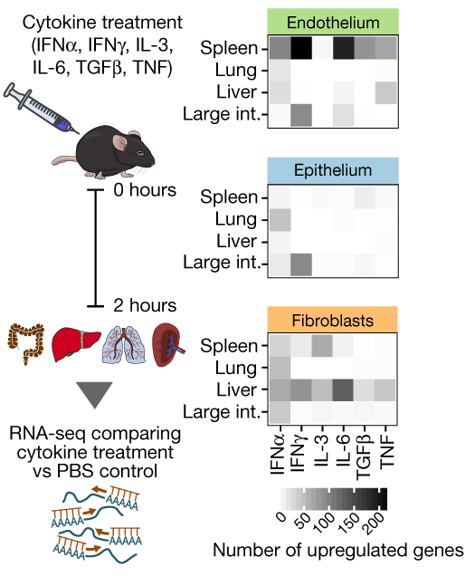

# Hands-on-Biomedical-Data
Practical exercises for the course "Hands-on Biomedical Data - Resources and Analysis Tools"

## Content
* Day 1: R programming and visualizations
* Day 2: Introduction in differential expression analysis
* Day 3: Differential expression analysis
* Day 4: Interaction effects
* Day 5: Assignment - analyze a dataset of your choosing

<!--  -->

## The example dataset
In this part of the practical, we will study transcriptomics data of structural cells in mice upon cytokine stimulation from (Krausgruber & Fortelny et al., Nature, 2020)[https://doi.org/10.1038/s41586-020-2424-4]:

