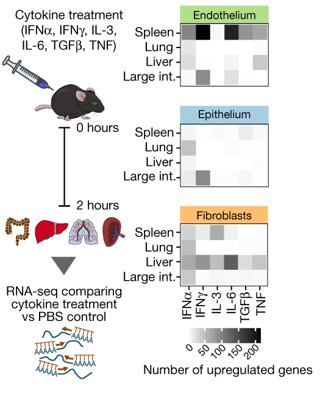

# Hands-on-Biomedical-Data
Practical exercises for the course "Hands-on Biomedical Data - Resources and Analysis Tools"

## Content
* Prelearning: [R 4 Data Science](day0_prelearning.md)
* Day 1: [Basic R programming and visualizations](day1.md)
* Day 2: [Introduction in differential expression analysis](day2.md)
* Day 3: [A more complex example](day3.md)
* Day 4: [Interaction effects](day4.md)
* Day 5: [Assignment - analyze a dataset of your choosing](day5.md)

You can run the practicals on:
* [Your personal computer](setup_PersonalLaptops.md)(ideal case)
* [Within Galaxy](setup_GALAXY.md)
* [On the PLUS Server RICARDA](setup_RICARDA.md)

## Evaluation
For the evaluation, we will use:
* Your code in R Scripts files that you will generate and which document your progress
* Your exercises and findings in a protocol (text file, for example generated with Word) that answers questions from the practicals
* These can be two separate files, or they can be combined using Markdown (see below)

Note:
* Save **one R script for each day** to not mix exercises and R sessions from different days.
* Save the R scripts as `day1.R`, `day2.R`, `day3.R`, `day4.R`, and `day5.R`.
* While you can execute commands from your script in any order, make sure your finally submitted script runs through from top to bottom if started from an empty environment!
* We will send you an email and you should send your files by replying to this email.
* The deadline is (Dec 10th, 2023).

Markdown:
* If you work on your personal computer, you can combine code and answers to questions using Markdown. See the following: [Markdown instructions](markdown.md)
* If you do use Markdown (on your personal computer), create HTML files using `File > Knit Document` in R. Please **DO NOT** use `File > Knit Document` on Ricarda.

## The example dataset

In this part of the practical, we will study transcriptomics data of structural cells in mice upon cytokine stimulation from [Krausgruber & Fortelny et al., Nature, 2020](https://doi.org/10.1038/s41586-020-2424-4).
 
 

## Basic analyses steps covered
* Quality control using sample correlations and dimensionality reduction
* Data normalization
* Differential expression
* Model diagnostics and quality control
* Plotting of results
* Interpretation of top genes
* Gene set enrichment analysis

## How to get help?
* Most commands should be explained in this practical.
* If you do not understand certain functions, type the question mark plus the function name in R, e.g.: "?median".
* If you need additional commands, Google is your friend. 
* Also consult this [list of function names](functions.md), which contains key functions relevant for this course.
* **Don't forget to raise you hand if lost!**
