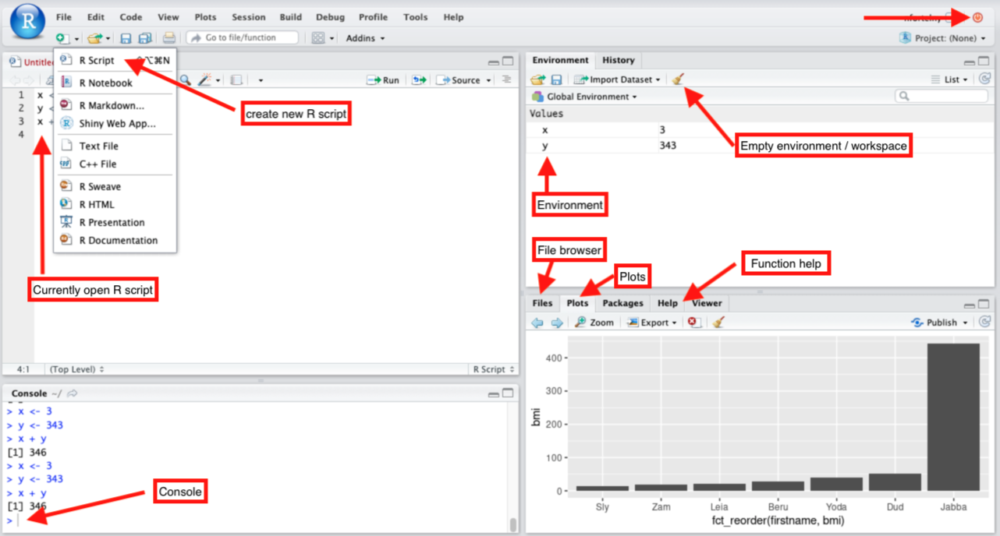

# R programming and visualizations
In this part, we will get started with R and Rstudio. Throughout this course, you will run R commands from these files in Rstudio. You can type them but you can also copy/paste them. One way is to open this window on side of your screen, and open you R studio in a different window, on the other side of the screen. If you can use another browser, you may be able to use `Strg + TAB` to switch bettween the two windows using your keyboard (and don't have to click between tabs).


## Getting R studio setup
* Visit ricarda.came.sbg.ac.at
* Enter your username and password
* Click on the top left `File > R Script` to create a new R script (see image below)
* Write `print("hello world")` in the R script
* Press `Strg + ENTER`, then the code should get executed in the console



### R studio basics
For this part of the practical (next 5 days), you will be writing R code in R scripts:
* When you log in you have started an `R session`
* When you execute commands in the  console (bottom left) the output and potential error or warning messages will appear in the console 
* When you also create variables, they get stored in your `environment` (see top right)
* You can restart your session by quitting the session (top right, red button)
* You can also clear objects from your environment (also called "workspace") by clicking the small yellow broom icon on the top right under "Environment"
* Plots and help packages appear in the bottom right. There is also a file browser that you can use to open files.
* We will almost always work with R scripts (top left) and use `Strg + ENTER` to "send" individual commands or sections of commands (marking them with the mouse) to the console, where they will be executed
* ***While you can execute commands from your script in any order, make sure your script runs through from top to bottom if started from scratch - so do not use variables before you define them!***


## Evaluation with R Markdown
* For the evaluation, we will consider the R Markdown HTML files that you will generate from your script.
* Save **one R script for each day** to not mix exercises and R sessions from different days. (Only exception is today, where we will generate two scripts, one to explore R Markdown (see below) and one to learn R.)
* Save the R scripts as `day1.R`, `day2.R`, `day3.R`, `day4.R`, and `day5.R`.
* After running R Markdown this will generatethe following HTML files: `day1.html`, `day2.html`, `day3.html`, `day4.html`, and `day5.html`. We will collect these files from the server (your user's home directory) and use them for the evaluation. 

### R Markdown
For this course, you will create reports of your R code and session using R Markdown. Create an R script, save it ("Markdown_intro.R"), and then write the following:
```R
a <- 1
b <- 3
a + b
```
* Now go to `File > Knit Document` (top right). This will generate a HTML file (you may be asked whet)
* Now go to `Files` (bottom right) and open the HTML file in the Web Browser.
* Now let's format the markdown a little bit, write the following in your Markdown file:
```R
# This is a "normal" comment inside of code blocks 
str(a)

#' this is a comment that will be shown outside of code blocks
str(b)

#'# This is a major heading (level 1)
#'## This is a heading of level 2
#'### This is a heading of level 3

#' Now let's plot something
plot(1:10)

#' Let's change the size of the plot
#+ plot1, fig.width=10
plot(1:10)

#' Let's change the size of the plot again
#+ plot2, fig.width=5, fig.height=10
plot(1:10)
```


## Loading packages

Type (copy/paste) the following into your R script. This will enable you to load packages from the HOME directory of user "handson", where the packages required for this course are installed. In your research, you will want (and have) to install your own packages, which in R just requires the command `install.packages(PACKAGE_NAME)`. For this course we chose to install packages centrally in order to (1) not duplicated installations and (2) make sure everyone uses the same packages
```R
.libPaths("/home/handson/R/x86_64-pc-linux-gnu-library/4.0/")
```

Once packages are installed (which they are already), you only need to load them in your current session, load the following packages:
```R
require(tidyverse)
require(pheatmap)
```

## Variables

Now let's explore some basic variables
```R
a <- 1
b <- 3
typeof(a)
typeof(b)
str(a)
str(b)
a
b
```

## Functions
```R
#' The sum function can be applied to numbers 
sum(a,b)
a + b
sum(5,6)
c <- sum(a,b)
(c <- sum(a,b))
str(c)
sum(a,c)

#' The sum function cannot be applied to characters
a <- "abc"
b <- "hello"
sum(a,b)
typeof(a)
typeof(b)
str(a)
str(b)

#' Caution: Some data structures can be automatically interpreted
a <- TRUE
b <- FALSE
sum(a,b)
sum(a,a)
typeof(a)
typeof(b)
str(a)
str(b)
```

## Vectors
```R
vec <- c(1,2,3,4,1,2,3)
names(vec) <- LETTERS[1:4]
str(vec)
sum(vec)
mean(vec)
vec[2]
vec[3]
vec["A"]
vec[c("A", "D")]
unique(vec)
1:10
-5:5
vec <- 10:1
vec[2:3]
```

## Lists
```R
list_x <- list("a", 1, "b", "xyz", TRUE)
str(list_x)
list_x[[1]]
str(list_x[[1]])
str(list_x[1])
list_x[[2]]
list_x[2:4]
str(list_x[2:4])

vec_x <- c("a", 1, "b", "xyz", TRUE)
#' R has converted all non-characters to characters!
str(vec_x) 
```

## Loops and conditions
```R
for(x in 1:6){
  print(paste("x =", x))
  if(x > 3){
    print("...x is greater than three")  
  }
  if(x == 2){
    print("...x equals two")
  }
  if(x != 4){
    print("...x is not four")
  }
  if(x %% 2 == 0){
    print("...x is even")
  } else {
    print("...x is uneven")
  }
  if(x %in% c(3,5)){
    print("...x is three or five")
  }
  print("-------")
}
```

## Matrices
```R
m <- readRDS("/home/handson/data/data.RDS")
str(m)
dim(m)
head(m)
m <- m[1:20, grepl("Liver_Fibroblasts", colnames(m))]
colnames(m) <- gsub("^Liver_Fibroblasts_(.+)_RNA_(\\d)$", "\\1_\\2", colnames(m))
row.names(m) <- paste0("g", 1:nrow(m))
str(m)
m
t(m)
str(m)
dim(m)
dim(t(m))
row.names(m)
colnames(m)
cor(m, method="spearman")
pheatmap(cor(m, method="spearman"))

cMT <- cor(m, method="spearman")
diag(cMT) <- NA
pheatmap(cMT)
```

## Data frames and dplyr

We will work with the `starwars` dataset, an example dataset of starwars characters. This is not a `data.frame` but a `tibble`, but they can be treated using similar functions, and we will convert the table to a data.frame later.
```R
starwars
str(starwars$name)
```

Useing `?stopifnot` to see if the results are what we expect. Here we test whether each name occurs only once, if the number of unique names is the same as the number of rows of the table.
```R
stopifnot(length(unique(starwars$name))==nrow(starwars))
```

Let's keep only columns that are not of type `list`, then we can convert the table to a `data.frame`:
```R
sw <- starwars %>%
  select(where(function(x) !is.list(x))) %>%
  as.data.frame()
```

Use the function `?count` to count the number of rows (characters) by their `homeworld`.
```R
sw %>% count(homeworld)
```

Now we will add a new column called `firstname`
```R
sw <- sw %>% 
  mutate(firstname = str_remove(name, " .+$")) 
```

Assess the gender balance of this table, using `?count` and `gender`


Count the number of characters by their `skin_color`.

How is the above different from the code below? Execute parts of the code below, what is the difference?
```R
sw %>%
  pull("skin_color") %>%
  str_split(", ") %>%
  unlist() %>%
  table() %>%
  sort()
```
* `pull` extracts a column from the `data.frame`
* `str_split` splits strings (characters) by some character
* `unlist` transforms a list into a vector
* `table` is simlar to `count` and counts the occurances
* `sort` orders a vector

Print the names of everyone over 2m (height greater than 200) by fixing the following code (replace `???` with the correct code).
```R
sw %>%
  filter(???) %>%
  pull(???)
```

In the data.frame `sw`, use the function `?mutate` to calculate the body mass index (BMI) for all characters using the formula `mass/(height/100)^2`, storing this in the new column `bmi` .

Look at the distribution of these values. Note, below are three ways of extracting a column from a `data.frame`
```R
# The dollar sign can be used with names
quantile(sw$bmi, na.rm = TRUE)

# data.frames are lists, thus the same syntax with two squared brackets works
quantile(sw[["bmi"]], na.rm = TRUE)

# the function 'pull' can also extract columns
quantile(pull(sw, "bmi"), na.rm = TRUE)
```

## Plotting
We will use ggplot to visualize results. The following is a basic plot.
```R
ggplot(sw, aes(x=mass, y=height)) + geom_point()
```

You can also store a plot in a variable. 
```R
px <- ggplot(sw, aes(x=mass, y=height))
```

Note that here the `geom_point()` was not called. So the following is an empty plot:
```R
px
```

Add points to this plot:
```R
px + geom_point()
```

Add `?geom_hex` to the plot.

In addition to the points above, add labels to the points:
* Add `?geom_text` to the plot, in addition to `?geom_point`. To do so, you will have to choose which text will be displayed. Do so by using `firstname` in the `label` aesthetic.
* Modify to only plot `?geom_text` for characters with mass greater than 1000. You can do this by setting the `data` parameter in `geom_text`
* Modify the `color` and `shape` in `geom_point`

Use `?geom_histogram` to plot a histogram of the `height`. Note: you only need an `x` aesthetic.

Modify the plot to show the density `?geom_density` and the empirical cumulative distribution function `?stat_ecdf` instead.

Now let's plot the BMI of some individuals:
```R
sw %>% 
  group_by(gender) %>%
  top_n(3, bmi) %>%
  ggplot(aes(x=fct_reorder(firstname, bmi), y=bmi, fill=gender)) + 
  geom_bar(stat="identity")
```

Modify the above plot to add facets with `?facet_grid`. There is a lot of white space. Remove white space by change the `space` and `scales` parameters.


# Downloading a dataset
For this practical, on day 5, you will analyze a gene expression dataset of your choosing using R, based on the examples from days 2-4. In the following, we will use the Gemma.R package that enables us to easily download datasets from GEMMA, a database where datasets have been manually curated.

Let's load the required packages:
```
# we will load packages installed in the directory of user "handson"
.libPaths("/home/handson/R/x86_64-pc-linux-gnu-library/4.0/")

require(gemma.R)
require(tidyverse)
```

First, we will look for a dataset of interest. As an example, we will here look for datasets related to neuroblastoma. You can of course look for any type of topic you are interested in. 
```R
searchDatasets("neuroblastoma", limit = 100, taxon = "human") %>%
  filter(geeq.batchCorrected == TRUE) %>%
  select(ee.ShortName, ee.Name, ee.ID, ee.Accession, ee.Samples)
```

Next, pick on dataset and explore the description.
```R
gse <- "GSE21713"

getDatasetsInfo(gse) %>%
  select(ee.ShortName, ee.Name, ee.ID, ee.Description)
```

Next, have a look at the design table for this dataset.
```R
d <- getDatasetDesign(gse)
str(d)
head(d)
with(d, table(batch, genotype))
```

Download the expression data.
```R
e <- getDatasetExpression(gse)
str(e)
colnames(e)
e <- as.data.frame(e)
```

The expression data is a data.frame / data.table object. We want to convert this to a matrix.
```R
# row.names of the design table are the sample names. Here we check whether they are all present in the expression matrix.
stopifnot(all(row.names(d) %in% colnames(e)))

# Next, let's get only the columns corresponding to sample names, make a matrix, and add gene symbols as row.names.
dataMT <- as.matrix(e[,row.names(d)])
str(dataMT)
row.names(dataMT) <- e$GeneSymbol
str(dataMT)
```

In the examples from day 2-5, we need to voom transform data (log2CPM). In GEMMA, this has already been done.
```R
boxplot(dataMT, las=2)
```

Now, explore another term (other than "neuroblastoma") and another dataset (other than GSE21713).

For more details on the final assignment see the [instructions for day 5](day5.md).