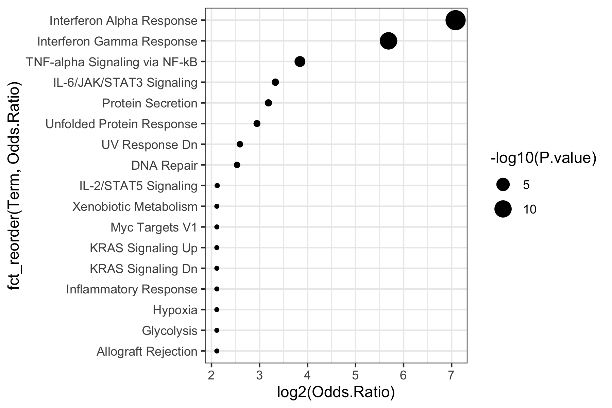

# Introduction in differential expression analysis


## Setup
First load packages.
```R
require(tidyverse)
require(limma)
require(pheatmap)
require(ComplexHeatmap)
require(enrichR)
```

Then load the data. 
```R
data <- readRDS("data.RDS") # update
metadata <- readRDS("design.RDS") # update
gmap <- readRDS("gmap.RDS") # update
```

 `Exercise 2.1:`
For all three objects above, answer the following questions:
* What type of object is it?
* How many rows and columns are this object?
* What information is contained in rows and columns?
Remember functions: `str`, `head`, `dim`, and similar.

## Subset data
In today's exercise, we will only work with liver fibroblasts (Gp38 positive) that were treated with interferon alpha, and compare them to those cultivated only in phosphate buffered saline (PBS). To subset the dataset accordingly we need the following steps:
* Filter the metadata table accordingly
* Subset the data matrix by selecting only the columns that are in the filtered metadata table
* Use `stopifnot()` to make sure the data matrix has as many columns as the metadata table as rows.
* After subsetting, the metadata table should only contain 6 rows and the data matrix only 6 columns.

## Correlation analysis

### Correlation heatmap
* THe correlation heatmap can inform us on the signal (difference between groups) to noise (variability within groups) ratio, as well as outliers, batch effect,... as discussed in the lecture.
* Use the correlation function in R `cor()` to correlate the samples in the data matrix. Use Spearman correlation instead of the default Pearson correlation. Type `?cor` if you need help with the function.
* Save the resulting correlation heatmap under the variable `corMT`

 `Exercise 2.2:`
Generate and discuss the heatmap of the correlation heatmap using the function `Heatmap()`

### MDS projection
Finally, we will use the calculated correlations to project the samples on 2 dimensions. The entire code for this step is shown below. This will:
* Transform correlations into distance measures by calculating `2-correlation`
* Run the function `cmdscale()` to get a 2-dimensional projection
* Modify the table to add information relevant for plotting
* Plot the samples on two dimensions
* --> don't forget: You can execute parts of the code to better understand what it does!
```R
data.frame(cmdscale(dist(2-corMT),eig=TRUE, k=2)$points) %>%
  add_column(stimulus = metadata$stimulus) %>%
  rownames_to_column("sample") %>%
  mutate(sn = gsub("^.+?_(\\d)$", "\\1", sample)) %>%  # This shortens the sample names to just the number at the end
  ggplot(aes(x=X1,y=X2)) + 
  geom_point(aes(color=stimulus)) +
  geom_text(aes(label=sn)) +
  theme_bw()
```

## Differential expression and data normalization
In the next step we will compare interferon-treated to PBS control samples.

### Setup up the model matrix
The model matrix, also called "design matrix", defines which group will be set as the intercept and which comparisons will be performed. In R, the function `model.matrix()` is used for this purpose. In our case, we only compare stimulated to unstimulated samples, so we can use:
```R
model.matrix(~stimulus, data=metadata)
```

 `Exercise 2.3:`
* Store the model matrix under a variable
* Make a heatmap of the resulting model matrix
* Describe which condition is taken as the control / reference / intercept. This should be PBS. 
* If the reference is not the right one, use `factor()`, `relevel()`, and `mutate()` to change the factor levels in the metadata.
* Then make another model matrix, store it in your variable, and make another heatmap to see if it works correctly now.


### Normalize data
After defining the design matrix, we can use limma voom to normalize the data (by library size and log normalize).
```R
dataVoom <- voom(data, design=your_model_matrix, plot = TRUE) # insert your model matrix
```

*Side note: We now used the word "design" twice in different ways:*
1. The metadata contains the `experimental design`, which defines which samples are from which conditions.
2. The model.matrix contains the `model design`, which defines which samples and conditions will be compared, what will be the intercept, and so on.

Now let's look at the data before and after normalization. The original data is in the object `data`, the normalized data is in `dataVoom$E`, which is part of the object return by running `voom(...)`.

 `Exercise 2.3:`
* What types of objects are those two?
* Use `boxplot()` to plot the distributions of the first few (30) genes of the original matrix. Try both of the following approaches. What's the difference?
	* `boxplot(data[1:30,])`
	* `boxplot(t(data[1:30,]))`
* Now use `dataVoom$E` to plot a boxplot of the first 30 genes.
* Now lot's look at the density of one gene using three approaches. What's the difference?
	* `plot(density(data[8,]))`
	* `plot(density(dataVoom$E[8,]))`
	* `plot(density(log2(data[8,])))`

### Perform differential expression
After having normalized the data we can fit the differential expression model. This calculates the log fold changes and p-values.
```R
limmaFit <- lmFit(dataVoom, design=your_model_matrix)
limmaFit <- eBayes(limmaFit)
```

Now let's look at which coefficients we get
```R
head(coef(limmaFit))
```

Next, we extract the results from these models. The following code does the following:
* creates an empty list
* loops through all coefficients estimated by the model
* stores results (log fold changes, p-values,...) as a table across all 20k genes for each coefficient into the list, using the name of the coefficient for the list entry (`limmaRes[[coefx]]`)
* then combines all tables from this list into one large table, that gets one extra column which is called `coef`
* finally remove the `(Intercept)`, which we are not interested in as it does not measure the difference between groups
```R
limmaRes <- list() # start an empty list
for(coefx in colnames(coef(limmaFit))){ # run a loop for each coefficient
  limmaRes[[coefx]] <- topTable(limmaFit, coef=coefx,number = Inf) # topTable returns the statistics of our genes. We then store the result of each coefficient in a list.
}
limmaRes <- bind_rows(limmaRes, .id = "coef") # bind_rows combines the results and stores the name of the coefficient in the column "coef"
limmaRes <- filter(limmaRes, coef != "(Intercept)") # then we keep all results except for the intercept
```

## Data interpretation

### Vulcano plot
The [vulcano plot]("https://en.wikipedia.org/wiki/Volcano_plot_(statistics)") can be created by plotting the `-log10(P.Value)` on the y-axis against the `logFC` on the x-axis.
The plot gets its characteristic shape since those genes that are highly significant (large value on y-axis) also have large effects (differences between groups) in both directions (negative and positive log fold changes).

 `Exercise 2.4:` draw a vulcano plot from the `limmaRes` object using a scatterplot `geom_point`. The point has many thousand points (genes). Can you overcome this overplotting by using transparency (e.g. `alpha=0.3`) or binning (e.g. `geom_hex`)?

### P-value distribution
The [p-value distribution]("http://varianceexplained.org/statistics/interpreting-pvalue-histogram/") is a good visualization to diagnose potential problems of our model. 

 `Exercise 2.5:`
* Draw a p-value distribution using `geom_histogram`.
* Is this distribution as expected?
* Use `fill=factor(floor(AveExpr)` to color the bins by the average expression level of each gene. What can you conclude from this?

### Number of hits
Now, count the number of genes that are tested `count()`. 
Then, create a new table `limmaResSig` where you retain only those genes that significantly change between conditions, thus filtering on the `adj.P.Val`. Consider also filtering lowly expressed genes based on the above plots (p-value distribution).

 `Exercise 2.6:`
Report the number of tested and significant genes.

## Visualizing results
A key element of any statistical analysis is to visualize results (differential genes) to assess whether the statistics obtained match the data. 

### Visualizing one gene
 `Exercise 2.7:`
* Pick one gene with significant effects and a large absolute (negative or positive) log fold change from `limmaResSig`.
* Now create a table that we can use to plot this gene. To this end, modify the table `metadata` by adding the normalized expression of your gene of interest, taken from `dataVoom$E`, as a new column.
* Generate a plot, where the x-axis is the stimulus (IFNa or PBS) and the y-axis is the expression of the gene.
* Does the observed difference on this plot fit to the log fold change?
* Note: You don't have to write the log fold change on the plot.

Example plot:


### Visualizing multiple genes
 `Exercise 2.8:`
* From `limmaResSig`, get the 30 genes with the greatest absolute `logFC` using the command `top_n()` and save their ENSEMBL IDs, which are the row names of the table, in the object `goi` (genes of interest) using the function `row.names()`.
* Generate a heatmap of their gene expression from `dataVoom$E` using `Heatmap()`.
* This unnormalized gene expression can show strong differences between genes, which may hide differences between groups. To solve this issue, scale the expression of all genes (rows of your matrix) using `t(scale(t(HM)))`, where `HM` is the matrix. See `t()` and `scale()` for details.
* Now let's refine this plot a bit more. Split the rows into up- and down-regulated genes using `row_split=ifelse(limmaRes[goi,]$logFC > 0, "up", "down")` in the heatmap function `Heatmap()`.
* Next, split the columns based on stimulus: `column_split = metadata$stimulus`, again in the heatmap function `Heatmap()`.

Example resulting plot:


## Enrichment analysis
Enrichment analysis help in interpreting long lists of genes. By measuring whether certain gene sets are enriched in our list of differential genes (often called hit list), enrichment analysis informs us on the involvement of biological pathways (among others) in the processes studied. 
* First, filter all genes with `logFC > 0` from the table of significant genes and store their Ensembl IDs (as a vector) in the object `goi` (note, this will overwrite the value of this object defined previously - so if you are going back to the previous exercise, you wil have to redefine the object).
* Next convert the ENSEMBL IDs to gene symbols: `goi <- gmap[goi,]$external_gene_name %>% unique()`. Note: `gmap` is a `data.frame` with row names, which we here use to access the right rows, the same way we have previously done for matrices.
* Next perform enrichment analysis using the function `enrichr()` with `databases = c("MSigDB_Hallmark_2020", "GO_Biological_Process_2021")` and store the results in the objec `enr.res`.
* The `enr.res` object is a list, which contains two entries `enr.res$MSigDB_Hallmark_2020` and `enr.res$GO_Biological_Process_2021`, one for each of the two databases tested.

 `Exercise 2.9:`
* Now visualize the results based on the top 30 significant hits from each database (make a separate plot for each database).
* Did the interferon alpha treatment result in the up-regulation of the expected gene sets?


## Final questions
 `Exercise 2.10:`
* Looking at the correlation heatmap and MDS plot - do you see strong effects and clear differences between groups?
* Does it make sense to filter lowly expressed genes?
* Do you trust the results of differential expression?
* Looking at the enriched genes and pathways - are the results expected?
