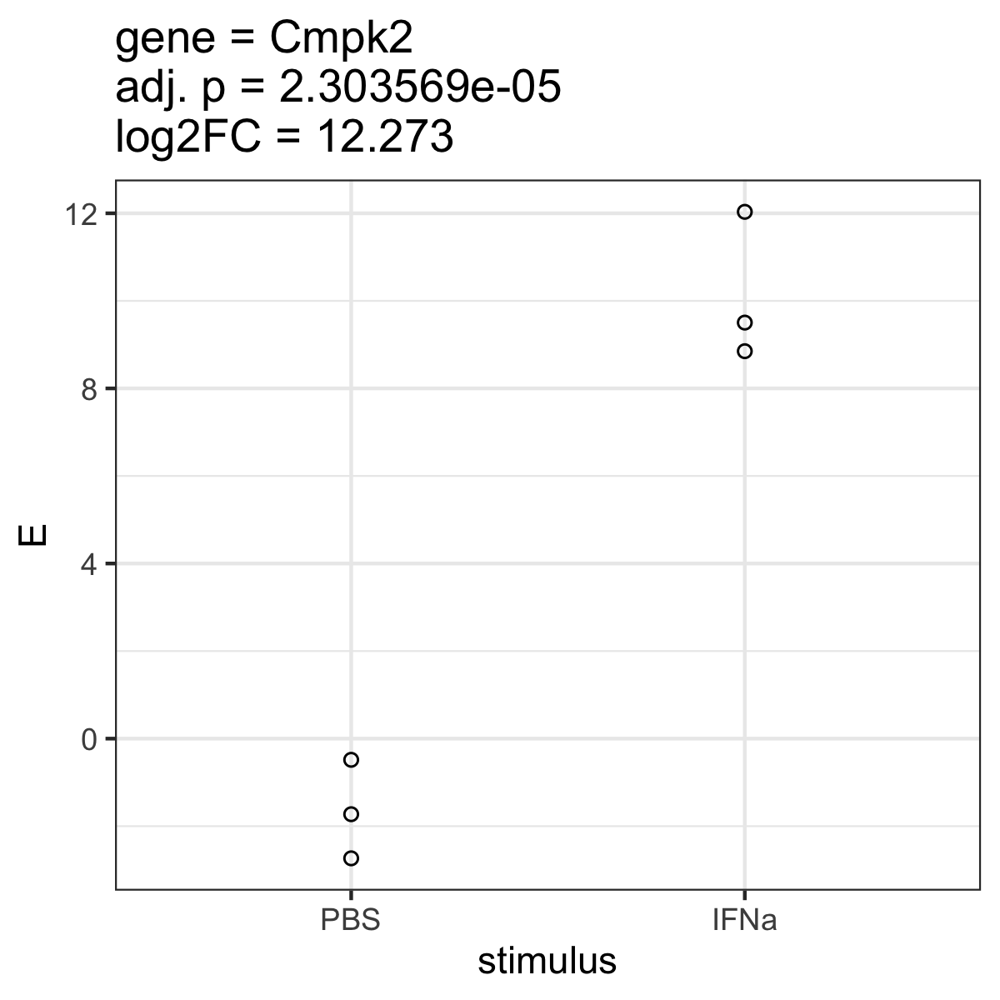
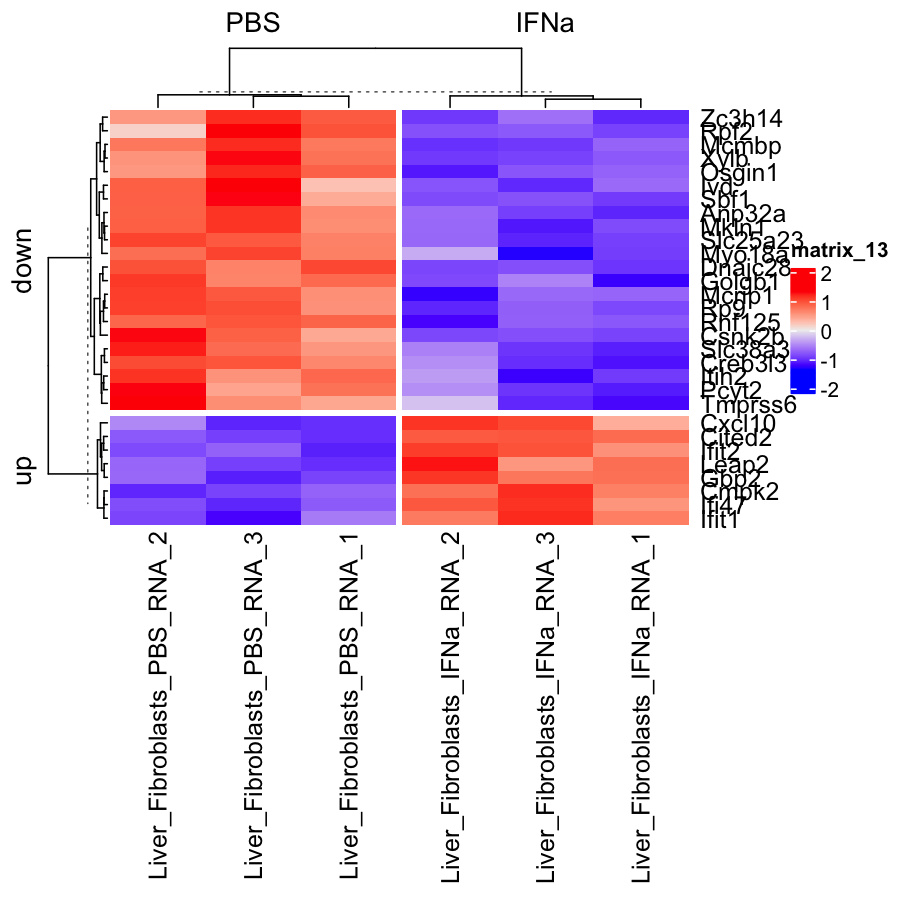

# Introduction in differential expression analysis


## Setup
First load packages.
```R
require(tidyverse)
require(limma)
require(ComplexHeatmap)
require(enrichR)
```

Then load the data. 
```R
# update the path if you downloaded to a different folder eg. readRDS("/Downloads/design.RDS")
data <- readRDS("data.RDS") # update
metadata <- readRDS("design.RDS") # update
gmap <- readRDS("gmap.RDS") # update
```

 `Exercise 2.1:`
For all three objects above, answer the following questions:
* What type of object is it?
* How many rows and columns are this object?
* What information is contained in rows and columns?
Remember functions: `str`, `head`, `dim`, and similar.

## Subset data
In today's exercise, we will only work with liver fibroblasts (Gp38 positive) that were treated with interferon alpha, and compare them to those cultivated only in phosphate buffered saline (PBS). To subset the dataset accordingly we need the following steps:
* Filter the metadata table to the samples described above. 
* Once this works, *overwrite* `metadata` (this means you store the result of filtering `metadata` in the variable `metadata`). Then you are not tempted to use the unfiltered metadata later on, which could lead to errors.
* Subset the data matrix to the samples which are now in your updated metadata. The column names of `data` are the row names of `metadata`. Thus, you can filter `data` by selecting only the columns that are the rows of the newly filtered `metadata`. Again, overwrite `data` with the subsetted matrix.
* Use `stopifnot()` to make sure the data matrix has as many columns as the metadata table as rows.
* After subsetting, the metadata table should only contain 6 rows and the data matrix only 6 columns.

## Correlation analysis

### Correlation heatmap
* The correlation heatmap can inform us on the signal (difference between groups) to noise (variability within groups) ratio, as well as outliers, batch effect,... as discussed in the lecture.
* Use the correlation function in R `cor()` to correlate the samples in the data matrix. Type `?cor` if you need help with the function.
* Use Spearman correlation instead of the default Pearson correlation (reads are not normalized).
* Save the resulting correlation matrix under the variable `corMT`.
* Generate a heatmap of the correlation matrix using the function `Heatmap()`. 

 `Exercise 2.2:`
Provide the heatmap of the correlation matrix. Did you (or should you) remove the diagonal from the correlation matrix heatmap?

Note: There are multiple heatmap functions in R:
* The function `heatmap()` is built-in (not a package that you need to load) but very old and the plots are not as pretty.
* The function `pheatmap()` from the `pheatmap` package is newer and has nice out-of-the-box functionality. We used this on day 1.
* The function `Heatmap()` from the `ComplexHeatmap` package has lots of options of costumizing the plot. We will use this in days 2-5.

### MDS projection
Finally, we will use the calculated correlations to project the samples on 2 dimensions. The entire code for this step is shown below. This will:
* Transform correlations into distance measures by calculating `2-correlation`
* Run the function `cmdscale()` to get a 2-dimensional projection
* Modify the table to add information relevant for plotting
* Plot the samples on two dimensions
* --> don't forget: You can execute parts of the code to better understand what it does!
```R
data.frame(cmdscale(dist(2-corMT),eig=TRUE, k=2)$points) |>
  add_column(stimulus = metadata$stimulus) |>
  rownames_to_column("sample") |>
  mutate(sn = gsub("^.+?_(\\d)$", "\\1", sample)) |>  # This shortens the sample names to just the number at the end
  ggplot(aes(x=X1,y=X2)) + 
  geom_point(aes(color=stimulus)) +
  geom_text(aes(label=sn)) +
  theme_bw()
```

## Differential expression and data normalization
In the next step we will compare interferon-treated to PBS control samples.

### Setup up the model matrix
The model matrix, also called "design matrix", defines which group will be set as the intercept and which comparisons will be performed. In R, the function `model.matrix()` is used for this purpose. In our case, we only compare stimulated to unstimulated samples, so we can use:
```R
model.matrix(~stimulus, data=metadata)
```

* Store the model matrix under a variable
* Make a heatmap of the resulting model matrix
* Describe which condition is taken as the control / reference / intercept. This should be PBS. 
* If the reference is not the right one, use `factor()`, `fct_relevel()`, and `mutate()` to change the factor levels in the metadata.
* Then make another model matrix, store it in your variable, and make another heatmap to see if it works correctly now.

 `Exercise 2.3:`
Provide the heatmap of your final model matrix. Which coefficient from the model matrix compares which groups?

### Normalize data
After defining the design matrix, we can use limma voom to normalize the data (by library size and log normalize).
```R
dataVoom <- voom(data, design=your_model_matrix, plot = TRUE) # insert your model matrix
```

*Side note: We now used the word "design" twice in different ways:*
1. The metadata contains the `experimental design`, which defines which samples are from which conditions.
2. The model matrix contains the `model design`, which defines which samples and conditions will be compared, what will be the intercept, and so on.

Now let's look at the data before and after normalization. The original data is in the object `data`, the normalized data is in `dataVoom$E`, which is part of the object return by running `voom(...)`.


 `Exercise 2.4:`
Use `boxplot()` to plot the distributions of the first few (30) genes of the original matrix. Try both of the following approaches. 
	* `boxplot(data[1:30,])`
	* `boxplot(t(data[1:30,]))`
        * What's the difference?

 `Exercise 2.5:`
Now lot's look at the density of one gene using three approaches.
	* `plot(density(data[8,]))`
	* `plot(density(dataVoom$E[8,]))`
	* `plot(density(log2(data[8,])))`
        * What's the difference?

### Perform differential expression
After having normalized the data we can fit the differential expression model. This calculates the log fold changes and p-values.
```R
limmaFit <- lmFit(dataVoom, design=your_model_matrix)
limmaFit <- eBayes(limmaFit)
```

Now let's look at which coefficients we get
```R
head(coef(limmaFit))
```

Next, we extract the results from these models. The following code does the following:
* creates an empty list
* loops through all coefficients estimated by the model
* stores results (log fold changes, p-values,...) as a table across all 20k genes for each coefficient into the list, using the name of the coefficient for the list entry (`limmaRes[[coefx]]`)
* then combines all tables from this list into one large table, that gets one extra column which is called `coef`
* finally remove the `(Intercept)`, which we are not interested in as it does not measure the difference between groups
```R
limmaRes <- list() # start an empty list
for(coefx in colnames(coef(limmaFit))){ # run a loop for each coefficient
  limmaRes[[coefx]] <- topTable(limmaFit, coef=coefx,number = Inf) # topTable returns the statistics of our genes. We then store the result of each coefficient in a list.
}
limmaRes <- bind_rows(limmaRes, .id = "coef") # bind_rows combines the results and stores the name of the coefficient in the column "coef"
limmaRes <- filter(limmaRes, coef != "(Intercept)") # then we keep all results except for the intercept
```

## Data interpretation

### Vulcano plot
The [vulcano plot]("https://en.wikipedia.org/wiki/Volcano_plot_(statistics)") can be created by plotting the `-log10(P.Value)` on the y-axis against the `logFC` on the x-axis.
The plot gets its characteristic shape since those genes that are highly significant (large value on y-axis) also have large effects (differences between groups) in both directions (negative and positive log fold changes).

 `Exercise 2.6:` Draw a vulcano plot from the `limmaRes` object using a scatterplot `geom_point`. The point has many thousand points (genes). Can you overcome this overplotting by using transparency (e.g. `alpha=0.3`) or binning (e.g. `geom_hex`)?

### P-value distribution
The [p-value distribution]("http://varianceexplained.org/statistics/interpreting-pvalue-histogram/") is a good visualization to diagnose potential problems of our model.  Note: The p-value distribution has the original (not log-transformed and also not adjusted) p-values on the x-axis.

 `Exercise 2.7:`
Draw a p-value distribution using `geom_histogram`.

 `Exercise 2.8:`
Is this distribution as expected? Use `fill=factor(floor(AveExpr)` to color the bins by the average expression level of each gene. Should you filter some genes? Which ones? If so, filter the genes, overwrite `limmaRes` with the result of the filtering and continue with the corrected data.

### Number of hits
Now, count the number of genes that are tested `count()`. 
Then, create a new table `limmaResSig` where you retain only those genes that significantly change between conditions, thus filtering on the `adj.P.Val`. Consider also filtering lowly expressed genes based on the above plots (p-value distribution).

 `Exercise 2.9:`
Report the number of tested and significant genes for the comparison of stimulated versus unstimulated. Report the code (should just be a few lines) you use to answer the questions.

## Visualizing results
A key element of any statistical analysis is to visualize results (differential genes) to assess whether the statistics obtained match the data. 

### Visualizing one gene
 `Exercise 2.10:`
* Pick one gene with significant effects and a large absolute (negative or positive) log fold change from `limmaResSig`. Report the log fold change.
* Now create a table that we can use to plot this gene. To this end, modify the table `metadata` by adding the normalized expression of your gene of interest, taken from `dataVoom$E`, as a new column.
* Generate a plot, where the x-axis is the stimulus (IFNa or PBS) and the y-axis is the expression of the gene.
* Does the observed difference on this plot fit to the log fold change?
* Note: You don't have to write the log fold change on the plot but you should report it in the protocol.

Example plot:


### Visualizing multiple genes
 `Exercise 2.11:`
* From `limmaResSig`, get the 30 genes with the greatest absolute `logFC` using the command `slice_max()`, which we saw on day 1, and save their ENSEMBL IDs, which are the row names of the table, in the object `goi` (genes of interest) using the function `row.names()`.
* What is the content of `goi`?
* Generate a heatmap of their gene expression from `dataVoom$E` using `Heatmap()`.
* This unnormalized gene expression can show strong differences between genes, which may hide differences between groups. To solve this issue, scale the expression of all genes (rows of your matrix) using `t(scale(t(HM)))`, where `HM` is the matrix. See `t()` and `scale()` for details.
* Now let's refine this plot a bit more. Split the rows into up- and down-regulated genes using `row_split=ifelse(limmaRes[goi,]$logFC > 0, "up", "down")` in the heatmap function `Heatmap()`.
* Next, split the columns based on stimulus: `column_split = metadata$stimulus`, again in the heatmap function `Heatmap()`.

Example resulting plot:


## Enrichment analysis
Enrichment analysis help in interpreting long lists of genes. By measuring whether certain gene sets are enriched in our list of differential genes (often called hit list), enrichment analysis informs us on the involvement of biological pathways (among others) in the processes studied. 
* First, filter all genes with `logFC > 0` from the table of significant genes and store their Ensembl IDs (as a vector) in the object `goi` (note, this will overwrite the value of this object defined previously - so if you are going back to the previous exercise, you wil have to redefine the object).
* Note: look at the object `goi` - what does it contain now?
* Next convert the ENSEMBL IDs to gene symbols:
```R
goi <- gmap[goi,]$external_gene_name |> unique()
```
Note: `gmap` is a `data.frame` with row names, which we here use to access the right rows, the same way we have previously done for matrices.
* Note: look at the object `goi` - what does it contain now?
* Next prepare the background/universe set
```R
universe <- gmap$gene_unique[match(limmaRes$ensg, rownames(gmap))] |> unique()
universe <- unique(universe[!is.na(universe) & universe != ""])
```
* Specify the database of genesets
```R
msigdb_mouse <- msigdbr(species = "Mus musculus", category = "H")
```
*convert to list of genes per pathway format
```R
MSigDB <- split(msigdb_mouse$gene_symbol, msigdb_mouse$gs_name)
```
* Next perform Fisher's exact test enrichment using the following and store the results in the objec `enr.res`.
Fisher enrichment
Fisher's exact test is performed against each pathway in the MSigDB database, 
```R
fisher_tbl <- map_df(names(MSigDB), function(pw) {
  pw_genes <- MSigDB[[pw]]
  sig_genes <- goi
  overlap <- intersect(sig_genes, pw_genes)
  a <- length(overlap)
  b <- length(sig_genes) - a
  c <- length(pw_genes) - a
  d <- length(universe) - (a+b+c)
  
  ft <- fisher.test(matrix(c(a,b,c,d),2), alternative = "greater")
  
  tibble(
    pathway = pw,
    pvalue = ft$p.value,
    odds_ratio = as.numeric(ft$estimate),
    DE_in_pathway = a,
    overlapping_genes = paste(overlap, collapse = ",")
  )
})
```
* Note: Alternative, see [here](fgsea.md) for an alternative approach used rank-based `fgsea` analysis.


 
Filter the results based on the top 30 significant hits
```R
top_30 <- fisher_tbl %>%
  mutate(p_adj = p.adjust(pvalue, "BH")) %>%
  arrange(p_adj) %>%
  slice_head(n = 30)
  ```
`Exercise 2.12:`
Now visualize the results based on the top 30 significant hits


## Final questions
Answer the questions below by again showing the relevant plots from the exercises above.

 `Exercise 2.13:`
Looking at the correlation heatmap and MDS plot - do you see strong effects and clear differences between groups? Discuss the signal to noise ratio of this dataset.

 `Exercise 2.14:`
Do you trust the results of differential expression? Do the observed differences in the (normalized) data fit to the log fold changes and p-values obtained from the statistical tests?

 `Exercise 2.15:`
Looking at the enriched genes and pathways - are the results expected?
