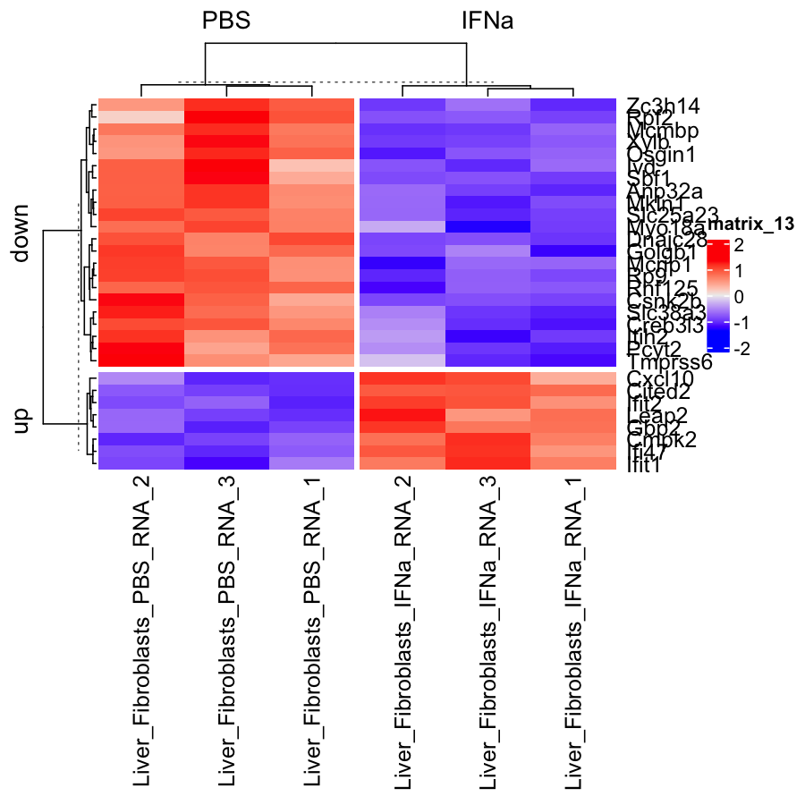

# Introduction in differential expression analysis


## Setup
First load packages.
```R
require(tidyverse)
require(limma)
require(ComplexHeatmap)
require(enrichR)
```

Then load the data.
```R
data <- readRDS("data.RDS")
design <- readRDS("design.RDS")
gmap <- readRDS("gmap.RDS")
```

For all three objects above, answer the following questions:
* What type of object is it?
* How many rows and columns are this object?
* What information is contained in rows and columns?

## Subset data
In today's exercise, we will only work with liver fibroblasts (Gp38 positive) that were treated with interferon alpha, and compare them to those cultivated only in phosphate buffered saline. To subset the dataset accordingly we need the following steps:
* Filter the design table accordingly
* Subset the data matrix by selecting only the columns that are in the filtered design table

After subsetting, the design table should only contain 6 rows and the data matrix only 6 columns.

## Correlation analysis

### Correlation heatmap

* Use the correlation function in R `?cor` to correlate the samples in the data matrix. 
* Next, generate a heatmap of the resulting correlation heatmap using the function `?Heatmap`

### MDS projection
Finally, we will use the calculated correlations to project the samples on 2 dimensions. The entire code for this step is shown below. This will:
* Transform correlations into distance measures by calculating `2-correlation`
* Run the function `?cmdscale` to get a 2-dimensional projection
* Modify the table to add information relevant for plotting
* Plot the samples on two dimensions
* --> don't forget: You can execute parts of the code to better understand what it does!
```R
data.frame(cmdscale(dist(2-corMT),eig=TRUE, k=2)$points) %>%
  add_column(stimulus = design$stimulus) %>%
  rownames_to_column("sample") %>%
  mutate(sn = gsub("^.+?_(\\d)$", "\\1", sample)) %>%
  ggplot(aes(x=X1,y=X2)) + 
  geom_point(aes(color=stimulus)) +
  geom_text(aes(label=sn)) +
  theme_bw()
```

## Differential expression and data normalization
In the next step we will compare interferon-treated to PBS control samples.

### Setup up the model matrix
The model matrix, also called "design matrix", defines which group will be set as the intercept and which comparisons will be performed. In R, the function `?model.matrix` is used for this purpose. In our case, we only compare stimulated to unstimulated samples, so we can use:
```R
model.matrix(~stimulus, data=design)
```
* Make a heatmap of the resulting model.matrix
* Now figure out which condition is taken as the control / reference / intercept. This should be PBS. 
* If the reference is not the right one, use `factor`, `?relevel`, and `?mutate` to change the  factor levels. Then make another heatmap to see if it fits now.

### Normalize data
After defining the design matrix, we can use limma voom to normalize the data.
```R
voom(data, design=model, plot = TRUE) # insert your model matrix with design=model
```


### Perform differential expression

### Vulcano plot
The [vulcano plot]("https://en.wikipedia.org/wiki/Volcano_plot_(statistics)") can be created by plotting the `-log10(P.Value)` on the y-axis against the `logFC` on the x-axis. The plot gets its characteristic shape since those genes that are highly significant (large value on y-axis) also have large effects (differences between groups) in both directions (negative and positive log fold changes).
* draw a vulcano plot from the `limmaRes` object using a scatterplot `geom_point`. The point has many thousand points (genes). Can you overcome this overplotting by using transparency (e.g. `alpha=0.3`) or binning (e.g. `geom_hex`)?

### P-value distribution
The [p-value distribution]("http://varianceexplained.org/statistics/interpreting-pvalue-histogram/") is a good visualization to diagnose potential problems of our model. Draw a p-value distribution using `geom_histogram`.

### Number of hits
Now, count the number of genes that are tested `?count`. Then, create a new table `limmaResSig` where you retain only those genes that significantly change between conditions, thus filtering on the `adj.P.Val`. Consider also filtering lowly expressed genes based on the above plots (p-value distribution).

## Visualizing results
A key element of any statistical analysis is to visualize results (differential genes) to assess whether the statistics obtained match the data. 

### Visualizing one gene
* Pick one gene with significant effects and a large absolute (negative or positive) log fold change from `limmaResSig`.
* Now create a table that we can use to plot this gene. To this end, modify the table `design` by adding the normalized expression of your gene of interest, taken from `dataVoom$E`, as a new column.
* Generate a plot, where the x-axis is the stimulus (IFNa or PBS) and the y-axis is the expression of the gene.
* Does the observed difference on this plot fit to the log fold change?

Example plot:


### Visualizing multiple genes
* From `limmaResSig`, get the 30 genes with the greatest absolute `logFC` using the command `?top_n` and save their ENSEMBL IDs, which are the row names of the table, in the object `goi` (genes of interest) using the function `?row.names`.
* Generate a heatmap of their gene expression from `dataVoom$E` using `?Heatmap`.
* This unnormalized gene expression can show strong differences between genes, which may hide differences between groups. To solve this issue, scale the expression of all genes (rows of your matrix) using `t(scale(t(HM)))`, where `HM` is the matrix. See `?t` and `?scale` for details.
* Now let's refine this plot a bit more. Split the rows into up- and down-regulated genes using `row_split=ifelse(limmaRes[goi,]$logFC > 0, "up", "down")` in the heatmap function `?Heatmap`.
* Next, split the columns based on stimulus: `column_split = design$stimulus`, again in the heatmap function `?Heatmap`.

Example resulting plot:


## Enrichment analysis
