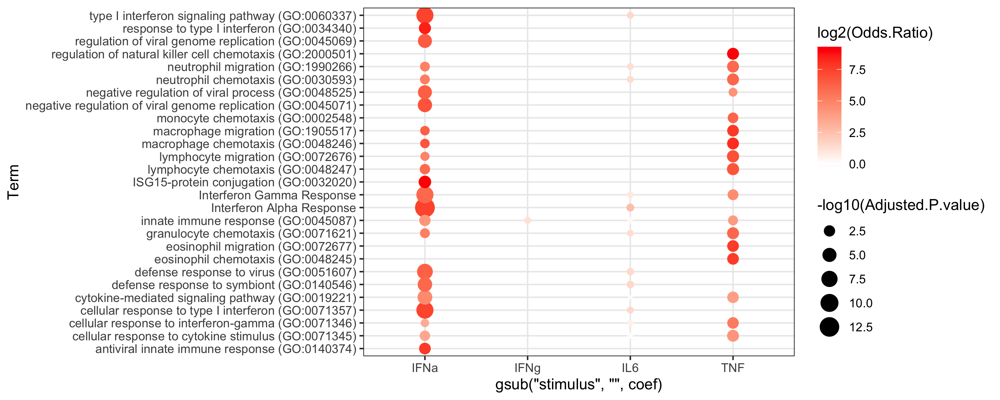

# A more complex example
In this exercise, we will repeat the analysis from the introductory exercise, but analyze all six stimuli compared to PBS controls.

## Setup
First load packages.
```R
.libPaths("/home/handson/R/x86_64-pc-linux-gnu-library/4.0/")
require(tidyverse)
require(limma)
require(patchwork)
require(pheatmap)
require(ComplexHeatmap)
require(enrichR)
```

Load the data.
```R
data <- readRDS("/home/handson/data/data.RDS")
design <- readRDS("/home/handson/data/design.RDS")
gmap <- readRDS("/home/handson/data/gmap.RDS")
```

## Subset data
We will only work with liver fibroblasts (Gp38 positive) but use all stimuli.
* Filter the design table accordingly
* Subset the data matrix by selecting only the columns that are in the filtered design table
* How many samples do we end up with?
* Use `?stopifnot` to make sure the data matrix has as many columns as the design table.


## Correlation analysis

### Correlation heatmap

* Use the correlation function in R `?cor` to correlate the samples in the data matrix. 
* Next, generate a heatmap of the resulting correlation heatmap using the function `?pheatmap`

### MDS projection
Finally, use MDS projection, using the same code from the last exercise:
```R
data.frame(cmdscale(dist(2-corMT),eig=TRUE, k=2)$points) %>%
  add_column(stimulus = design$stimulus) %>%
  rownames_to_column("sample") %>%
  mutate(sn = gsub("^.+?_(\\d)$", "\\1", sample)) %>% # This shortens the sample names to just the number at the end
  ggplot(aes(x=X1,y=X2)) + 
  geom_point(aes(color=stimulus)) +
  geom_text(aes(label=sn)) +
  theme_bw()
```

## Differential expression and data normalization
In the next step we will compare stimulated to PBS control samples.

### Setup up the model matrix
Just like yesterday, we compare stimulated to unstimulated samples. Make sure the correct reference (PBS) is used by generating a heatmap of the model matrix.
```R
model.matrix(~stimulus, data=design)
```

### Normalize data
Now use limma voom to normalize the data.
```R
dataVoom <- voom(data, design=model, plot = TRUE) # insert your model matrix with design=model
```

### Perform differential expression
After having normalized the data we can fit the differential expression model. 
```R
limmaFit <- lmFit(dataVoom, design=model)
limmaFit <- eBayes(limmaFit)
```

Now let's look at which coefficients we get
```R
head(coef(limmaFit))
```

Next, we extract the results from these models.
```R
limmaRes <- list() # start an empty list
for(coefx in colnames(coef(limmaFit))){ # run a loop for each coefficient
	print(coefx)
  limmaRes[[coefx]] <- topTable(limmaFit, coef=coefx,number = Inf) # topTable returns the statistics of our genes. We then store the result of each coefficient in a list.
}
limmaRes <- bind_rows(limmaRes, .id = "coef") # bind_rows combines the results and stores the name of the coefficient in the column "coef"
limmaRes <- filter(limmaRes, coef != "(Intercept)") # then we keep all results except for the intercept
```

## Data interpretation

### Vulcano plot
Draw a vulcano plot from the `limmaRes` object. Use `?facet_wrap` or `?facet_grid` to separate the plots by the stimulus (coefficient).

### P-value distribution
Draw a p-value distribution using `geom_histogram`, separate the plot using facets, and again look at the `AveExpr`.

### Number of hits
Now, count the number of genes that are tested `?count`. Then, create a new table `limmaResSig` where you retain only those genes that significantly change between conditions, thus filtering on the `adj.P.Val`. Consider also filtering lowly expressed genes based on the above plots (p-value distribution).


## Visualizing results
A key element of any statistical analysis is to visualize results (differential genes) to assess whether the statistics obtained match the data. 

### Visualizing one gene
* Pick one gene from one comparison with significant effects and a large absolute (negative or positive) log fold change from `limmaResSig`.
* Now create a table that we can use to plot this gene. To this end, modify the table `design` by adding the normalized expression of your gene of interest, taken from `dataVoom$E`, as a new column.
* Generate a plot, where the x-axis is the stimulus (six stimuli and PBS) and the y-axis is the expression of the gene.
* Look at the log fold changes for all six stimuli. Do the observed differences on this plot fit to the log fold change?
* Note: You don't have to write the log fold change on the plot.

Example plot:


### Visualizing multiple genes
Now let's make the following plot, which shows the expression data (left) and the statistical results (right) for the top 5 genes from each comparison.


The steps below are outlined in detail. Make sure you understand the code, as you will have to modify it tomorrow.

#### get the genes of interest
Based on the significant hits in `limmaResSig`, group (`?group_by`) the hits by the coefficient `coef`, then get the top 5 genes by logFC (`top_n`), extract the ENSEMBL IDs from the column `ensg` using `?pull`, and store the result in a new object `goi.all`. 

#### plot statistical results
Next plot all statistical results for the genes above.
```R
(p.coef <- limmaRes %>%
  filter(ensg %in% goi.all) %>%
  mutate(gene = gmap[ensg,]$external_gene_name) %>%
  ggplot(aes(y=gene, x=gsub("stimulus", "", coef), color=logFC, size=-log10(adj.P.Val))) + 
  geom_point() +
  scale_color_gradient2(high="red", low="blue") +
  theme_bw())
```

#### plot expression data
First we will collect the expression data of each gene, writing a for loop over all genes, and storing the data.frame for each gene in a list.
```R
dat.list <- list()
for(gg in goi.all){
  dat.list[[gg]] <- design %>%
    mutate(E=scale(dataVoom$E[gg,])) %>%
    rownames_to_column("sample") %>%
    remove_rownames()
}
```

Next, we combine the above list of data.frame into one data.frame using `?bind_rows`, and then plot this data as a heatmap.
```R
(p.vals <- bind_rows(dat.list, .id="ensg") %>%
  mutate(gene = gmap[ensg,]$external_gene_name) %>%
  mutate(stimulus = as.character(stimulus)) %>%
  ggplot(aes(x=sample, y=gene, fill=E)) + 
  geom_tile() +
  facet_grid(. ~ stimulus, space ="free", scales = "free") +
  scale_fill_gradient2(low="blue", high="red"))
```

#### Final plot
Finally, we combine the two plots as below, using the "patchwork" package. This command should show you the plot shown above.
```R
p.vals + p.coef
```


## Enrichment analysis
Enrichment analysis help in interpreting long lists of genes. By measuring whether certain gene sets are enriched in our list of differential genes (often called hit list), enrichment analysis informs us on the involvement of biological pathways (among others) in the processes studied.

#### Perform enrichment analysis for each coefficient
Below is a loop over the individual coefficients. Within each iteration of this loop, perform enrichment analysis for each coefficient. 

As a reminder, this were the instructions from yesterday:
* First, filter all genes with `logFC > 0` from the table of significant genes and store them in the object `goi` (note, this will overwrite the value of this object defined previously - so if you are going back to the previous exercise, you wil have to redefine the object).
* Next convert the ENSEMBL IDs to gene symbols: `goi <- gmap[goi,]$external_gene_name %>% unique()`
* Next perform enrichment analysis using the function `?enrichr` with `databases = c("MSigDB_Hallmark_2020", "GO_Biological_Process_2021")` and store the results in the objec `enr.res`.
* The `enr.res` object is a list, which contains two entries `enr.res$MSigDB_Hallmark_2020` and `enr.res$GO_Biological_Process_2021`, one for each of the two databases tested.

``` R
enr.res.list <- list()
for(coefx in unique(limmaResSig$coef)){

	# Extract genes of interests (GOI) for a given coefficient (see yesterday's example)
	goi <- ....
	
	# Add code here to perform enrichment analysis (see yesterday's example)
	enr.res <- enrichr(...)
	
	# The results will be a list, where each entry is one database. We will combine those into one long table
	enr.res <- bind_rows(enr.res, .id="db")

  # Store results in the list
  enr.res.list[[coefx]] <- bind_rows(enr.res, .id="db")
}
```

Finally, we combine the list (each entry is one coefficient) into one long table:
```R
enr.res.all <- bind_rows(enr.res.list, .id="coef")
```

#### Plot enrichments

Now generate the following plot:



Note: The plot only includes entries with: `Adjusted.P.value < 0.01` and `Odds.Ratio > 6`


#### Plot genes related to the enrichments
Now we will extract the genes underlying the above enrichments:
```
goi.enr <- enr.res.all %>%
  filter(Adjusted.P.value < 0.01 & Odds.Ratio > 6) %>%
  pull("Genes") %>%
  str_split(";") %>%
  invoke(.f = c) %>%
  unique()
```

Then we will extract the statistics for these genes:
```R
limmaRes %>%
  filter(toupper(gene) %in% goi.enr)
```

Finall, generate the following plot:


