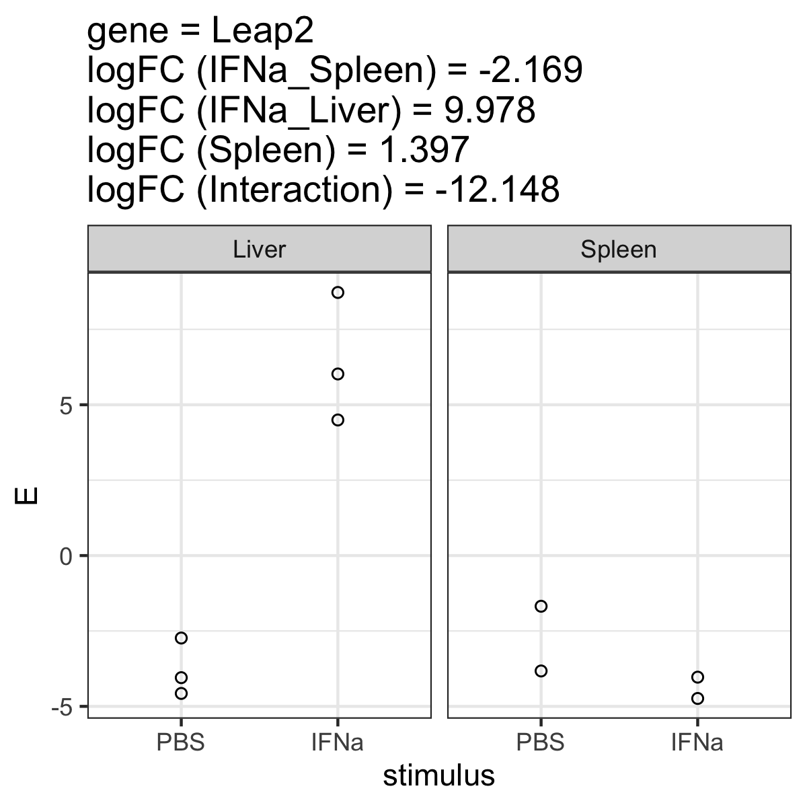

# Interaction effects
In this exercise, we will test differences along two axes:
* interferon alpha and PBS
* spleen and liver
We will thus be able if there is an interaction between those two effects, i.e. whether the effect of interferon treatment (stimulated versus unstimulated) differs between the two organs spleen and liver.

## Setup
First load packages.
```R
require(tidyverse)
require(limma)
require(patchwork)
require(ComplexHeatmap)

```

Load the data.
```R
data <- readRDS("data.RDS")
metadata <- readRDS("design.RDS")
gmap <- readRDS("gmap.RDS")
```

## Subset data
We will only work with liver and spleen fibroblasts (Gp38 positive) that were treated with interferon alpha, and compare them to those cultivated only in phosphate buffered saline..
* Filter the metadata table accordingly
* Subset the data matrix by selecting only the columns that are in the filtered metadata table
* Use `?stopifnot` to make sure the data matrix has as many columns as the metadata table.

 `Exercise 4.1:`
How many samples do we end up with?

## Correlation analysis

### Correlation heatmap
Generate the heatmap of the correlation matrix as discussed on day 2.

### MDS projection
Finally, use MDS projection, modify the code from the last exercise, to also show the organ of each sample using the `shape` aesthetic in ggplot.
```R
data.frame(cmdscale(dist(2-corMT),eig=TRUE, k=2)$points) |>
  add_column(stimulus = metadata$stimulus) |>
  rownames_to_column("sample") |>
  mutate(sn = str_replace(sample, "^.+?_(\\d)$", "\\1")) |>
  ggplot(aes(x=X1,y=X2)) + 
  geom_point(aes(color=stimulus)) +
  geom_text(aes(label=sn)) +
  theme_bw()
```

## Differential expression and data normalization
In the next step we will compare stimulated to PBS control samples, liver to spleen, and the interaction of both effects.

### Setup up the model matrix
Make sure the correct references (PBS for stimulus and Liver. for the organ) are used by generating a heatmap of the model matrix. Then setup the model matrix as follows:
```R
model.matrix(~stimulus*organ, data=metadata)
```

 `Exercise 4.2:`
Provide the heatmap of the model matrix. Which coefficient from the model matrix compares which groups?

### Normalize data
Now use limma voom to normalize the data.
```R
dataVoom <- voom(data, design=your_model_matrix, plot = TRUE) # insert your model matrix
```

### Perform differential expression
After having normalized the data we can fit the differential expression model. 
```R
limmaFit <- lmFit(dataVoom, design=your_model_matrix)
limmaFit <- eBayes(limmaFit)
```

Now let's look at which coefficients we get
```R
head(coef(limmaFit))
```

Next, we extract the results from these coefficients.
```R
limmaRes <- list() # start an empty list
for(coefx in colnames(coef(limmaFit))){ # run a loop for each coefficient
	print(coefx)
	# topTable returns the statistics of our genes. We then store the result of each coefficient in a list.
  limmaRes[[coefx]] <- topTable(limmaFit, coef=coefx,number = Inf) |>
		rownames_to_column("ensg")
}
limmaRes <- bind_rows(limmaRes, .id = "coef") # bind_rows combines the results and stores the name of the coefficient in the column "coef"
limmaRes <- filter(limmaRes, coef != "(Intercept)") # then we keep all results except for the intercept
```

### Fit contrast
The above model has four coefficients:
* Intercept
* stimulusIFNa: interferon alpha versus PBS (based on liver samples)
* organSpleen: spleen versus liver (based on PBS samples)
* Interaction effect ("stimulusIFNa:organSpleen")
Now, we want to also quantify the IFNa stimulus effect in spleen. To do so we fit a contrast, specifically summing up the IFNa effect PLUS the interaction:
```R
# look at the coefficient names
colnames(coef(limmaFit))

# make sure we have the right names, otherwise we have to adapt the next line
stopifnot(all(colnames(coef(limmaFit)) == c("(Intercept)", "stimulusIFNa", "organSpleen", "stimulusIFNa:organSpleen")))

# now create a contrast matrix
contrast.mt <- cbind(IFNa_Spleen = c(0,1,0,1)) # we add the 2nd and 4th coefficient.
row.names(contrast.mt) <- colnames(coef(limmaFit))

# look at the matrix
contrast.mt

# Contrast fit similar to the original limma fit
limmaFit.contrast <- contrasts.fit(limmaFit,contrast.mt)
limmaFit.contrast <- eBayes(limmaFit.contrast)

# Extract results for this contrast coefficient
limmaRes.contrast <- topTable(limmaFit.contrast, coef=colnames(contrast.mt),number = Inf) |>
  rownames_to_column("ensg") |>
  mutate(coef=colnames(contrast.mt))
	
# add them to the full table
limmaRes <- rbind(limmaRes.contrast, limmaRes) # add this coefficient to the result table
table(limmaRes$coef)
```

Now, we will clean up the table using regular expressions:
```R
limmaRes$gene <- gmap[limmaRes$ensg,]$external_gene_name # here we add the gene symbol
limmaRes <- limmaRes |>
  mutate(coef = str_replace(coef, "organ", "")) |> # remove "organ"
  mutate(coef = str_replace(coef, "stimulus", "")) |> # remove "stimulus"
  mutate(coef = str_replace(coef, "^IFNa$", "IFNa_Liver")) |> # rename "IFNa" to "IFNa_Liver"
  mutate(coef = str_replace(coef, "^IFNa\\:Spleen$", "Interaction")) # Name interaction
table(limmaRes$coef)
```

## Data interpretation
The steps below are identical (in terms of the code) to the example from yesterday. 

### Vulcano plot
Draw a vulcano plot from the `limmaRes` object. Use `?facet_wrap` or `?facet_grid` to separate the plots by the stimulus (coefficient).

### P-value distribution
Draw a p-value distribution using `geom_histogram`, separate the plot using facets, and again look at the `AveExpr`.

 `Exercise 4.3:`
Provide the vulcano plots and p-value distributions in your protocol.

### Number of hits
Now, count the number of genes that are tested `?count`. Then, create a new table `limmaResSig` where you retain only those genes that significantly change between conditions, thus filtering on the `adj.P.Val`. Consider also filtering lowly expressed genes based on the above plots (p-value distribution).

 `Exercise 4.4:`
Report the number of tested and significant genes (for each comparison/coefficient). Report the code (should just be a few lines) you use to answer the questions.

## Visualizing results
A key element of any statistical analysis is to visualize results (differential genes) to assess whether the statistics obtained match the data. 

### Visualizing one gene

 `Exercise 4.5:`
* Pick one gene with significant interaction effects that has a large absolute (negative or positive) log fold change from `limmaResSig`.
* Now create a table that we can use to plot this gene. To this end, modify the table `metadata` by adding the normalized expression of your gene of interest, taken from `dataVoom$E`, as a new column.
* Generate a plot, where the x-axis is the stimulus (IFNa or PBS) and the y-axis is the expression of the gene.
* Add facets to separate the organs and stimuli
* Look at the log fold changes for all coefficients. Do the observed differences on this plot fit to the log fold change?
* Note: You don't have to write the log fold changes on the plot but you should provide them in your protocol.

Example plot:


### Visualizing multiple genes
Now let's make the following plot, which shows the expression data (left) and the statistical results (right) for the top 5 genes from each comparison.


The steps below are outlined in detail. 

#### get the genes of interest
Based on the significant hits in `limmaResSig`, group (`?group_by`) the hits by the coefficient `coef`, then get the top 5 genes by logFC (`slice_max()`), extract the ENSEMBL IDs from the column `ensg` using `?pull`, and store the result in a new object `goi.all`. 

#### plot statistical results
Next plot all statistical results for the genes above. This plot is the same as yesterday.
```R
(p.coef <- limmaRes |>
  filter(ensg %in% goi.all) |>
  mutate(gene = gmap[ensg,]$external_gene_name) |>
  ggplot(aes(y=gene, x=str_remove(coef, "stimulus"), color=logFC, size=-log10(adj.P.Val))) + 
  geom_point() +
  scale_color_gradient2(high="red", low="blue") +
  theme_bw())
```

#### plot expression data
First we will collect the expression data of each gene, writing a for loop over all genes, and storing the data.frame for each gene in a list.
```R
dat.list <- list()
for(gg in goi.all){
  dat.list[[gg]] <- metadata |>
    mutate(E=scale(dataVoom$E[gg,])) |>
    rownames_to_column("sample") |>
    remove_rownames()
}
```

Next, we combine the above list of data.frame into one data.frame using `?bind_rows`, and then plot this data as a heatmap. The code below is the same as yesterday. Now, also separate samples by the organ.
```R
(p.vals <- bind_rows(dat.list, .id="ensg") |>
  mutate(gene = gmap[ensg,]$external_gene_name) |>
  mutate(stimulus = as.character(stimulus)) |>
  ggplot(aes(x=sample, y=gene, fill=E)) + 
  geom_tile() +
  facet_grid(. ~ stimulus, space ="free", scales = "free") +
  scale_fill_gradient2(low="blue", high="red"))
```

#### Final plot
Finally, we combine the two plots as below, using the "patchwork" package. This command should show you the plot shown above.
```R
p.vals + p.coef
```

 `Exercise 4.6:`
Provide the plot in your protocol. Make sure you modify the facets to separate the organs.

## Final questions

 `Exercise 4.7:`
Looking at the correlation heatmap and MDS plot - do you see strong effects and clear differences between groups?

 `Exercise 4.8:`
Did you identify interaction effects?

 `Exercise 4.9:`
Consider the one gene plotted in `Exercise 4.5`. Do the effects "add up", i.e. can you calculate the interaction effect from the other effects?

 `Exercise 4.10:`
Are treatment effects on average stronger in the liver or spleen? How do you assess this? Number of genes or log fold changes? Is there a clear difference?
