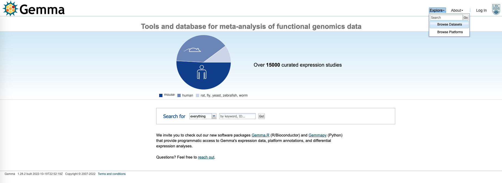

# Assignment - analyze a dataset of your choosing

## Gemma
* As seen on day 1, the Gemma database contains expression datasets with curated expression and meta-data. 
* The database can also be browsed using this [link](https://gemma.msl.ubc.ca/).
* Under this [link](https://gemma.msl.ubc.ca/expressionExperiment/showAllExpressionExperiments.html), we can search the available expression datasets.
* To access datasets with R, see the [Gemma Tutorial on day1](day1.md#downloading-a-dataset).

## Instructions
* For the final exercise of this (R) part of the practical, explore a dataset from Gemma using the function taught in this course.
* Be aware that based on the design table of the dataset, you will have to modify the design matrix (`model.matrix`) accordingly to correctly interpret the coefficients (for example, think about batch and interaction coefficients in addition to the main comparisons).
* Also - make sure you define an appropriate intercept term.
* While it is more elegant to analyze the full dataset, you can also subset the dataset if it is too large and/or complex.

## Questions
* Do you see strong effects and clear differences between groups?
* Which coefficient has the largest effects?
* Do you find differentially expressed genes?
* Looking at the enriched genes and pathways - are the results expected?