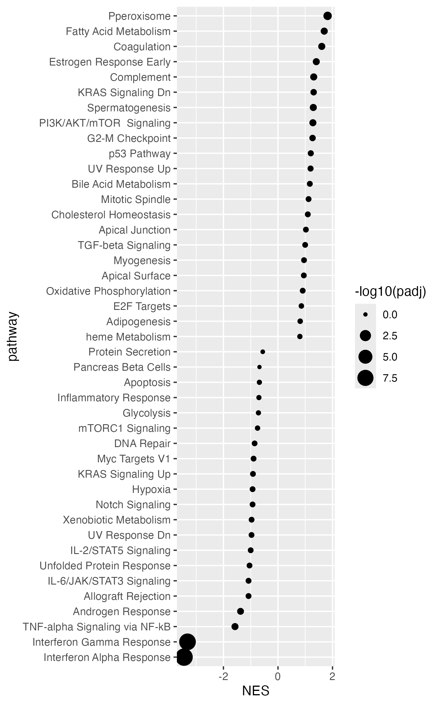

## If you use Galaxy, see the section [**On Galaxy**](https://github.com/csbg/Hands-on-Biomedical-Data/blob/main/fgsea.md#on-galaxy)  towards the end of this page

# rank-based fgsea analysis (alternative to EnrichR)

First we install the `fgsea` package.
```R
if (!require("BiocManager", quietly = TRUE))
    install.packages("BiocManager")

BiocManager::install("fgsea")
```

Then we load the package
```R
require(fgsea)
```

Then we download gene sets from the EnrichR database (https://maayanlab.cloud/Enrichr/). If you click on `Libraries` you should get to this [page](https://maayanlab.cloud/Enrichr/#libraries).

Now download two databases. Click on the red download symbol on the right.
- MSigDB Hallmark DB `MSigDB_Hallmark_2020`
- GO Biological Process `GO_Biological_Process_2023`

Look at those files. Each row is one gene set. Here is a function that you can use to load a database in R.
```R
read_enrichR_database <- function(path){
  # Read the file:
  res <- readLines(path)
  # Split each line by tabs:
  res <- strsplit(res, "\t")
  # First entry per tab is the gene set name:
  names(res) <- sapply(res, function(x) x[1])
  # Entries 3 to end are the gene names
  lapply(res, function(x) x[3:length(x)])
}
```

We start with the Hallmark DB:
```R
db <- read_enrichR_database("~/Downloads/MSigDB_Hallmark_2020.txt") # here you have to update the path.
```

Now we need to format our results to perform enrichment analysis. The following code assums that your limma results are in the table `degRes`. As it does not require a cutoff, for `fgsea` you can use either the whole list of genes or the only the signicant ones.

Here, we use only the significant ones.
```R
degRes <- limmaResSig
```

Add gene symbol as a column to the table.
```R
degRes$gene <- make.unique(gmap[row.names(degRes), "external_gene_name"])
```
 
Extract one column (here `t`, i.e. the t-value) and create a named vector using `setNames`, where the names are the gene symbols.
```R
degRankedList <- setNames(degRes$t, toupper(degRes$gene))
```

Perform fgsea analysis.
```R
res <- fgsea(
  pathways = db,
  stats = degRankedList)
```

Now create the following plot:



Note:
- When you run `fgsea` you are doing *rank-based* enrichment analysis. In this case you do not have to split up- and down-regulated genes. The full list is used instead.
- `NES` means normalized enrichment score. This tells you how strongly enriched a term is at the top or bottom of the list.

You can use the following code to visualize the data behind one pathway:
```R
plotEnrichment(db[["Interferon Alpha Response"]],
               degRankedList) +
			   labs(title="Interferon Alpha Response")
```

To extract genes that "caused" the observed enrichment (relevant for day 3 exercises), extract them from the column `leadingEdge`:
```R
goi.enr <- res |>
  filter(padj < 0.05 & abs(NES) > 1) |>
  pull("leadingEdge") |>
  unlist() |>
  unique()
```
## **On Galaxy**
You already have the datasets on the history, 
Now go to interactive Rstudio session 
Here is a function that you can use to load a database in R.
```R
read_enrichR_database <- function(path){
  # Read the file:
  res <- readLines(path)
  # Split each line by tabs:
  res <- strsplit(res, "\t")
  # First entry per tab is the gene set name:
  names(res) <- sapply(res, function(x) x[1])
  # Entries 3 to end are the gene names
  lapply(res, function(x) x[3:length(x)])
}
```

We start with the Hallmark DB:
```R
db <- read_enrichR_database(gx_get(**!!Pu the corresponding number for the dataset in your history**)) # here you have to update the path.
```
In my case the number is **23**


```R
db <- read_enrichR_database(gx_get(23))
```
